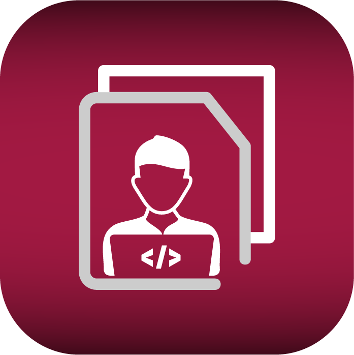

<!--
repo name: intechsip
description: An internship listing app.
github name:  Yasser-dev
email: yehab2000@gmail.com
-->

<!-- PROJECT LOGO -->
<br />
<p align="center">
    <a href="LINK">
        
    </a>
    <h3 align="center">INTECHSHIP</h3>
    
</p>

<!-- TABLE OF CONTENTS -->

## Table of Contents

- [About the Project](#about-the-project)
  - [Built With](#built-with)
- [Getting Started](#getting-started)
  - [Prerequisites](#prerequisites)
  - [Installation](#installation)

<!-- ABOUT THE PROJECT -->

## About The Project


Intechship is mobile app built using flutter as a project to participate in DSC Kita Hack Hackathon 2021. The app aims to help in achieving the 8th goal of the UN sustainable development goals (SDGs) as well as its targets by providing a platform that facilitates the process of finding and applying to internships for university students or anyone looking for internships in general. This will help students find internship opporunity.

### Built With

- [Flutter](https://flutter.dev/) 
- [Firebase](https://firebase.google.com/) 

## Screenshots

### Internships listings

<p float="left">
  
  
  
  
  
</p>

### Add a listing

<p float="left">
  
  
  
  
  
  
  
  
  
  
</p>
<!-- GETTING STARTED -->

## Getting Started

### Prerequisites

You are expected to have Flutter installed and running on your device.

### Installation

**Step 1:**

Download or clone this repo by using the link below:

```
https://github.com/Yasser-dev/intechship.git
```

**Step 2:**

Go to project root and execute the following command in console to get the required dependencies:

```
flutter pub get
```
